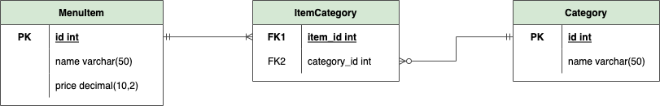
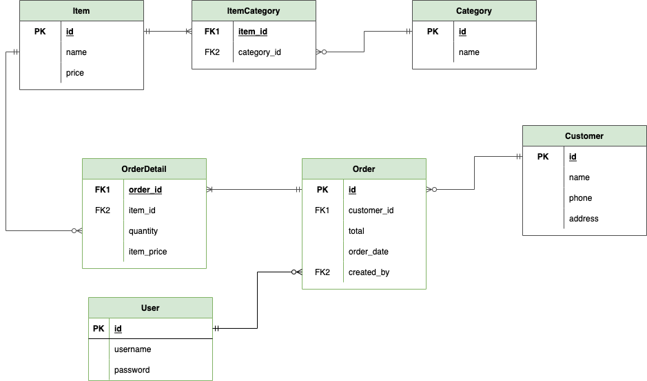

# DDL (Data Definition Language) & DML (Data Manipulation Language)
## Working with SQLite on Replit
There are several ways for working with SQLite on Replit. 
* `Run` `main.sql` file. We can write our statements into `main.sql` and simply click run button.
* Type into `Console` tab directly.
* Use `Shell` tab. This will simulate how we use SQLite on our local machine. 

Go to `Shell` tab, type `sqlite3` then press enter. It will take us into a simple SQLite command-line interface program.

```sh
$ sqlite3
SQLite version 3.35.5 2021-04-19 18:32:05
Enter ".help" for usage hints.
Connected to a transient in-memory database.
Use ".open FILENAME" to reopen on a persistent database.
sqlite> 
```

If we don't specify any argument when opening `sqlite3`, a temporary database will be created and automatically deleted when the `sqlite3` program exits.

Let's try to create a table inside this temporary database. Execute these commands, one line at a time (type one line, then press enter).

```sql
CREATE TABLE categories (id INTEGER, name VARCHAR(50));
INSERT INTO categories (id, name) VALUES (1, 'food');
SELECT * FROM categories;
```
* Line 1 will **create** a table named `categories` with 1 attribute `id`.
* Line 2 will **insert** a new record into the table `categories`.
* Line 3 will **read** all records from table `categories`.

Now when you type `.quit` and press enter, the program will be closed, and your data is gone. No worries, try that, and try opening `sqlite3` again to see.
```sql
SELECT * FROM categories;
```
It will say: 
```sh
Error: no such table: categories
```
To avoid that, let's start again from the beginning, re-create our table and insert our data. This time, **we add one more command to make sure that the database is persisted in the disk file**.

```sql
CREATE TABLE categories (id INTEGER);
INSERT INTO categories (id) VALUES (1);
SELECT * FROM categories;
.save orders.db
```
This will persist any data created and changed during the session into a file named `orders.db`. You can see that the file is automatically created on your `Files` list.

Since we already have this one database file, let's keep using this in the future for our exercise. Whenever you `.quit`, you can always use it by typing `sqlite3 orders.db` in your shell window to use this database.

> **Make sure you type a semicolon at the end of each SQL command!** The `sqlite3` program looks for a semicolon to know when your SQL command is complete.
> 
> You can also create your own database in separate file. Type `sqlite3 mydatabase.db`, and explore! 

## Tables Definition
DDL or Data Definition Language is a standard for commands that define the different structures in a database. The most common DDL commands are: 
```sql
CREATE TABLE table_name (...); 
ALTER TABLE table_name [ADD | DROP | RENAME] ...;
DROP TABLE table_name;
```
* `CREATE TABLE` is used for creating new table by defining the name of the table, its attributes, and their datatypes.
* `ALTER TABLE` is used for modifying an existing table.
* `DROP TABLE` is used for deleting an existing table along with its whole content.

Specific for SQLite, we can see table information with
* `.tables`, to show list of existing tables in a database.
* `pragma table_info('table_name');`, to show detail information of a table.

## Data Types
On RDBMS, in order to create a table, we need to know what type of data is stored in each table column.

It’s important to use the appropriate data types when you create table columns so that your tables are accurate and efficient.

There are a lot of data types that we can use for our database. We will cover commonly used ones. 

Each column in an SQLite database is assigned one of the following type affinities:
* TEXT
* NUMERIC
* INTEGER
* REAL
* BLOB

For more information regarding SQLite data types and affinities, please visit [SQLite data types](https://www.sqlite.org/datatype3.html).

|Data Type| Maximum|SQLite Affinity|
|---|
|CHAR|255 chars|TEXT|
|VARCHAR|65.535 chars|TEXT|
|TEXT|65.535 chars|TEXT|
|BLOB|65.535 bytes|BLOB|

|Data Type|Format|SQLite Affinity|
|--|
|DATE|YYYY-MM-DD|TEXT|
|DATETIME/TIMESTAMP|YYYY-MM-DD HH:mm:ss|TEXT|
|DATETIME in UNIX|Integer| NUMERIC|
 
|Data Type|Range|SQLite Affinity|
|--|
|INT|-2.147.483.648 to 2.147.483.648|INTEGER|
|BIGINT|-9.223.372.036.854.775.808 to 9.223.372.036.854.775.808|INTEGER|
|FLOAT|-3.402823466E+38 to -1.175494351E-38|REAL|
|DOUBLE|-1.7976931348623157E+ 308 to -2.2250738585072014E- 308|REAL|
|DECIMAL| constrained by the precision or scale for a given column (M, N)|NUMERIC|

## Quiz
Match the data with the appropriate data type.

||
|--|
|(1) Full name|(A) INT|
|(2) A two-letter country code|(B) CHAR(1)|
|(3) Cost of an item in USD < 1000|(C) DATE|
|(4) Date of birth|(D) DATETIME|
|(5) Number of items in stock| (E) VARCHAR(60)|
|(6) Is the store open? Y or N| (F) DEC(5,2)|
|(7) Purchase date| (G) CHAR(2)|

You can check the answer at the end of this module.

## Define data types for our schema

**Food Order Management System**

Let's pick up where we left off on our previous homework. By now, we should already identify necessary entities that we need on our system. You may have something like
- Item
- Category
- Item Category
- Order
- Order Detail
- Customer

We will focus on the first three entities for now. 



While entity name is usually represented by singular noun, by convention table name is usually in its plural term. So for entity `Category` we will create table `categories`, for entity `Item` we will create table `items`, and for `Item Category` we will have `item_categories`.

---

Type `.tables` to show list of existing tables in our current database.
```sql
.tables
```
We have `categories` here. Then we can see the schema of each table by using command `pragma table_info('table name');`

```sql
pragma table_info('categories');
```
The output will look like this:
```
cid|name|type|notnull|dflt_value|pk
0|id|INT|0||0
1|name|VARCHAR(50)|0||0
```
That doesn't look too readable. Let's prettify the output by changing the mode. Type `.mode markdown` once, and the output will look nicer throughout the session. 

> Each session is marked when the program starts until it quits.

**Input:**
```sql
.mode markdown
pragma table_info('categories');
```
**Output:**
```
| cid | name |    type     | notnull | dflt_value | pk |
|-----|------|-------------|---------|------------|----|
| 0   | id   | INT         | 0       |            | 0  |
| 1   | name | VARCHAR(50) | 0       |            | 0  |
```
We already have a table, but looks like we failed to define it with proper `primary key`. It said `pk` is `0` in all fields.

Unfortunately, SQLite does not support big alteration such as adding PK once the table is created. No worries though, our table is still small, we still can recreate it. 
> Do note this for future cases, define your primary key during table creation to avoid dropping and recreating tables. 

Now let's `drop` our existing table, and recreate it again with proper primary key.

```sql
DROP TABLE categories;
CREATE TABLE categories (id INTEGER NOT NULL PRIMARY KEY, name VARCHAR(50));
pragma table_info('categories');
```
Now the output will have `id` attribute marked as `pk`. Value `1` represents `true`, while `0` represents `false`.
```
| cid | name |    type     | notnull | dflt_value | pk |
|-----|------|-------------|---------|------------|----|
| 0   | id   | INTEGER     | 1       |            | 1  |
| 1   | name | VARCHAR(50) | 0       |            | 0  |
```

> Other RDMBS such as MySQL usually allows adding primary key to existing table. The command can go like `ALTER TABLE categories ADD PRIMARY KEY(id);`

Let's add 2 more tables into our database: `items` and `item_categories`.
```sql
CREATE TABLE items (
  id INTEGER PRIMARY KEY,
  name VARCHAR(50) DEFAULT NULL,
  price REAL DEFAULT 0
);

CREATE TABLE item_categories (
item_id INT,
category_id INT
);
```

## Data Manipulation Language (DML)
DML statements are used to work with (manipulate) the data in tables.

There are 4 types of DML statements:
* `INSERT` to add row/record(s) of data into a table.
* `SELECT` to view data from existing table(s).
* `UPDATE` to modify value of some existing row/record(s).
* `DELETE` to remove row/record(s) from a table.
```sql
INSERT INTO table_name ([field values]);
INSERT INTO table_name ([field names]) VALUES ([field values]);
SELECT [* | field names] FROM table_name;
SELECT [* | field names] FROM table_name WHERE condition [LIMIT | ORDER BY| GROUP BY];
UPDATE table_name SET field_name = 'field_value';
UPDATE table_name SET field_name = 'field_value' WHERE condition;
DELETE FROM table_name;
DELETE FROM table_name WHERE condition;
```

Let's try to insert records into our `items` table. 

If we specify the list of attribute names, we can fill according to that specified list.

If we don't specify the list of attribute names, it will follow the default sequence of attributes as defined on the table structure.
```sql
INSERT INTO items (id, name, price) VALUES 
(1, 'Nasi Goreng', 25000);

INSERT INTO items (id, name) VALUES 
(2, 'Air Putih');

INSERT INTO items VALUES 
(3, 'Spaghetti', 40000),
(4, 'Green Tea Latte', 18000);
```

To view the records, we can use `select` statement
```sql
SELECT id, name, price FROM items;
SELECT id, name FROM items;
SELECT * FROM items;
```
The result for the last statement might look something like:
```bash
+----+-----------------+-------+
| id | name            | price |
+----+-----------------+-------+
|  1 | Nasi Goreng     | 25000 |
|  2 | Air Putih       |     0 |
|  3 | Spaghetti       | 40000 |
|  4 | Green Tea Latte | 18000 |
+----+-----------------+-------+
```

By default, SQLite will auto increment column with type `INTEGER`. Let's add more records by relying on the auto increment. 
```sql
INSERT INTO items (name, price) VALUES 
('Orange Juice', 15000),
('Vanilla Ice Cream', 13000),
('Cordon Bleu', 36000),
('French Fries', 20000),
('Mango Juice', 15000);

SELECT * from items;
```

### Fetch the data with certain condition
I want list of items where the price is lower than 20000!
```sql
SELECT * FROM items WHERE price < 20000;
```
I want list of items where the price is between 15000 and 25000!
```sql
SELECT * FROM items WHERE price >= 15000 AND price <= 25000;
```
or
```sql
SELECT * FROM items WHERE price BETWEEN 15000 AND 25000;
```
I want the detail of item named `French Fries`
```sql
SELECT * FROM items WHERE name = 'French Fries';
```
I want items where name contains `Juice`
```sql
SELECT * FROM items WHERE name LIKE '%Juice%';
```

### Modifying Data

```sql
UPDATE items SET name = 'Nasi Goreng Gila' where id = 1;
UPDATE items SET name = 'Ice Water', price = 2000 where id = 2;
```
```sql
DELETE FROM items WHERE name = 'Mango Juice';
```


```sql
INSERT INTO categories (name) VALUES 
('main dish'), 
('beverage'), 
('dessert');

INSERT INTO item_categories (item_id, category_id) VALUES 
(1, 1), 
(2, 2), 
(3, 1),
(3, 1), 
(4, 2), 
(5, 2), 
(6, 3), 
(7, 1);
```
### SQL Join
A JOIN clause is used to combine rows from two or more tables, based on a related column between them.
```sql
SELECT items.id, items.name, item_categories.category_id
FROM items 
LEFT JOIN item_categories ON items.id = item_categories.item_id;

+----+-------------------+-------------+
| id | name              | category_id |
+----+-------------------+-------------+
|  1 | Nasi Goreng Gila  |           1 |
|  2 | Ice Water         |           2 |
|  3 | Spaghetti         |           1 |
|  4 | Green Tea Latte   |           2 |
|  5 | Orange Juice      |           2 |
|  6 | Vanilla Ice Cream |           3 |
|  7 | Cordon Bleu       |           1 |
|  8 | French Fries      |        NULL |
+----+-------------------+-------------+

```
Different types of SQL JOINs:
* (INNER) JOIN: Returns records that have matching values in both tables.

* LEFT (OUTER) JOIN: Returns all records from the left table, and the matched records from the right table.

* RIGHT (OUTER) JOIN: Returns all records from the right table, and the matched records from the left table.

### Inner Join

Returns records that have matching values in both tables.
```sql
SELECT items.id, items.name, item_categories.category_id
FROM items 
JOIN item_categories ON items.id = item_categories.item_id;

+----+-------------------+-------------+
| id | name              | category_id |
+----+-------------------+-------------+
|  1 | Nasi Goreng Gila  |           1 |
|  2 | Ice Water         |           2 |
|  3 | Spaghetti         |           1 |
|  4 | Green Tea Latte   |           2 |
|  5 | Orange Juice      |           2 |
|  6 | Vanilla Ice Cream |           3 |
|  7 | Cordon Bleu       |           1 |
+----+-------------------+-------------+
```

### Left Outer Join

Returns all records from the left table, and the matched records from the right table.
```sql
SELECT items.id, items.name, item_categories.category_id
FROM items 
LEFT JOIN item_categories ON items.id = item_categories.item_id;

+----+-------------------+-------------+
| id | name              | category_id |
+----+-------------------+-------------+
|  1 | Nasi Goreng Gila  |           1 |
|  2 | Ice Water         |           2 |
|  3 | Spaghetti         |           1 |
|  4 | Green Tea Latte   |           2 |
|  5 | Orange Juice      |           2 |
|  6 | Vanilla Ice Cream |           3 |
|  7 | Cordon Bleu       |           1 |
|  8 | French Fries      |        NULL |
+----+-------------------+-------------+
```

### Right (Outer) Join

Returns all records from the right table, and the matched records from the left table.
> Right outer join currently is not supported by SQLite.

So we can't run this on SQLite
> ```sql
SELECT items.id, items.name, item_categories.category_id
FROM items 
RIGHT JOIN item_categories ON items.id = item_categories.item_id;
```

But it basically is same with
```sql
SELECT items.id, items.name, item_categories.category_id
FROM item_categories 
LEFT JOIN items ON items.id = item_categories.item_id;

+----+-------------------+-------------+
| id | name              | category_id |
+----+-------------------+-------------+
|  1 | Nasi Goreng Gila  |           1 |
|  2 | Ice Water         |           2 |
|  3 | Spaghetti         |           1 |
|  4 | Green Tea Latte   |           2 |
|  5 | Orange Juice      |           2 |
|  6 | Vanilla Ice Cream |           3 |
|  7 | Cordon Bleu       |           1 |
+----+-------------------+-------------+
```

### Exercise: Query 
1. Show all records and details on items table with their respective category names
2. Show list of item id and item name where the category is ‘main dish’
3. Show list of item id, name, and price where the category is ‘main dish’ and price above 30000
4. Show list of items that does not have category
5. Bonus: Show list of unique categories, their matching item names listed as one row, and its maximum price (hint: aggregate, group, concat)

## Homework
Continuing from our previously defined ERD (from previous homework), and what we already have made so far,



1. Create more tables that will complete the entities set that we need for our system
2. Insert minimal 5 dummy records for each entity
3. Display data which contains all orders information, with their respective customer name and phone informations, along with list of items they ordered and how much they paid for each order.

Submission: Store all of the DDL & DML you use to create/alter tables, insert/update/query data on `main.sql`. Last DML statement should be the select query for question no. 3.

**Sample Query Result**

|order_id|order_date|name|phone|total|items|
|---|
|1|2020-10-10|Budiawan|+6212345678|27000|Nasi Goreng Gila, Ice Water|
|2|2020-10-10|Mary Jones |+6287654321|58000|Spaghetti, Green Tea Latte|
|3|2020-10-10|Budiawan|+6289753124|55000|Spaghetti, Orange Juice|
|4|2020-10-11|Budiawan|+6212345678|27000|Nasi Goreng Gila, Ice Water|
|5|2020-10-11|Mary Jones |+6287654321|54000|Cordon Bleu, Green Tea Latte|

## Further Reading
* [Database Normalization](https://medium.com/@itsmamipiyur/a-step-by-step-database-normalization-for-dummies-or-not-1b32b725e1be)
* [How to Normalize Database](https://www.youtube.com/watch?v=upS2HlUj1gI) 


## Answers
### Quiz
1. Full name (E) VARCHAR(60)
2. A two-letter country code (G) CHAR(2)
3. Cost of an item in USD < 1000 (F) DEC(5,2)
4. Date of birth (C) DATE
5. Number of items in stock (A) INT
6. Is the store open? Y or N (B) CHAR(1)
7. Purchase date (D) DATETIME

### Exercise: Query
```sql
-- 1
SELECT i.*, c.name
FROM items i
LEFT JOIN item_categories ic ON i.id = ic.item_id
LEFT JOIN categories c ON c.id = ic.category_id;

-- 2
SELECT i.id, i.name
FROM items i
LEFT JOIN item_categories ic ON i.id = ic.item_id
LEFT JOIN categories c ON c.id = ic.category_id
WHERE c.name = 'main dish';

-- 3
SELECT i.id, i.name, i.price
FROM items i
LEFT JOIN item_categories ic ON i.id = ic.item_id
LEFT JOIN categories c ON c.id = ic.category_id
WHERE c.name = 'main dish'
AND i.price > 30000;

-- 4
SELECT i.*
FROM items i
LEFT JOIN item_categories ic ON i.id = ic.item_id
LEFT JOIN categories c ON c.id = ic.category_id
WHERE c.name IS NULL;

-- 5
SELECT c.id, c.name, GROUP_CONCAT(i.name), MAX(i.price) 
FROM categories c 
LEFT JOIN item_categories ic ON ic.category_id = c.id 
LEFT JOIN items i ON i.id = ic.item_id 
GROUP BY c.id;
```